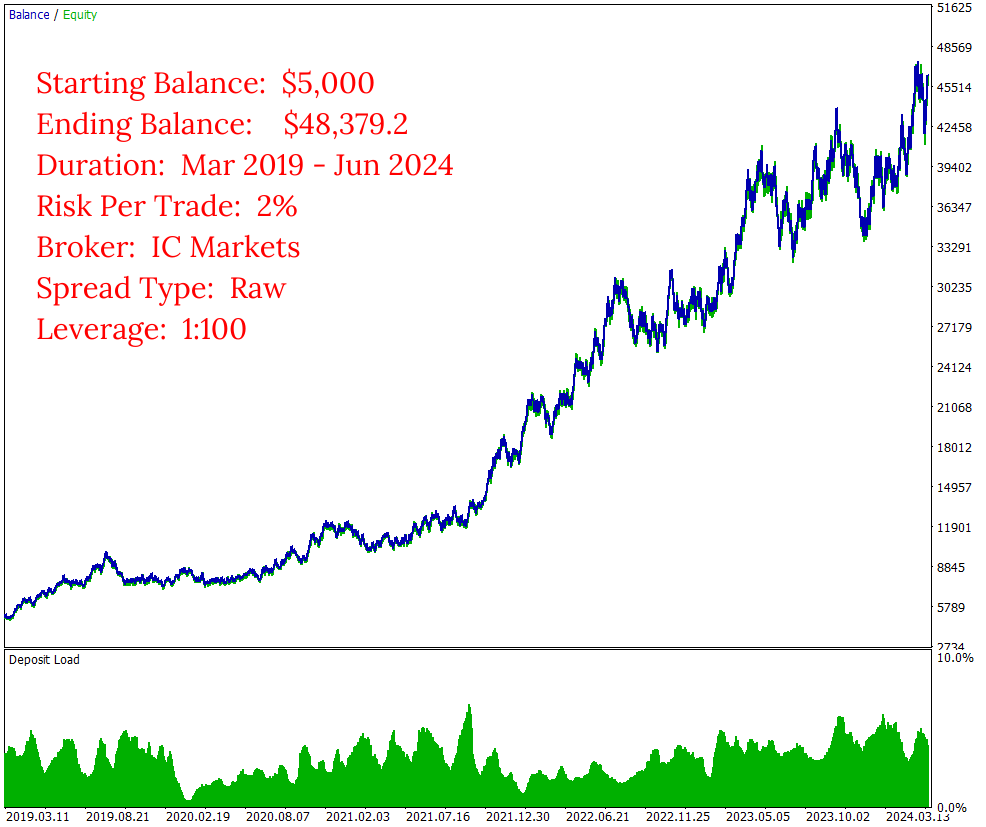
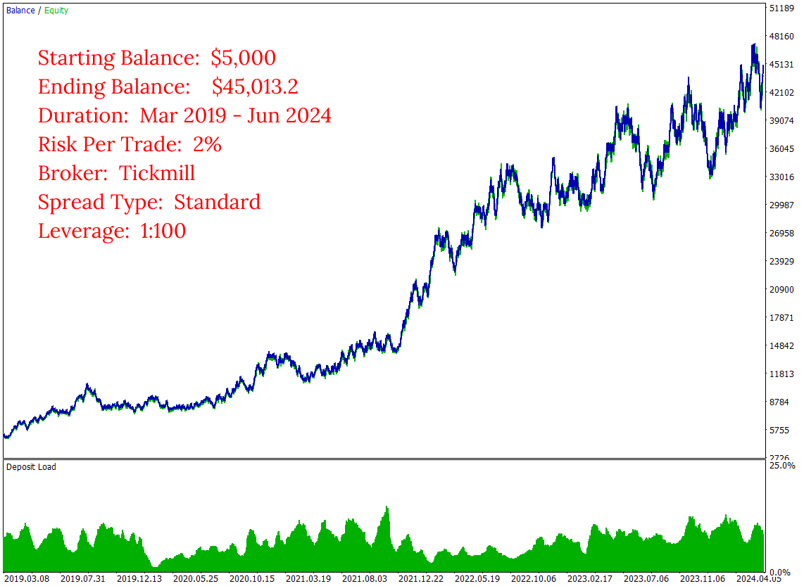
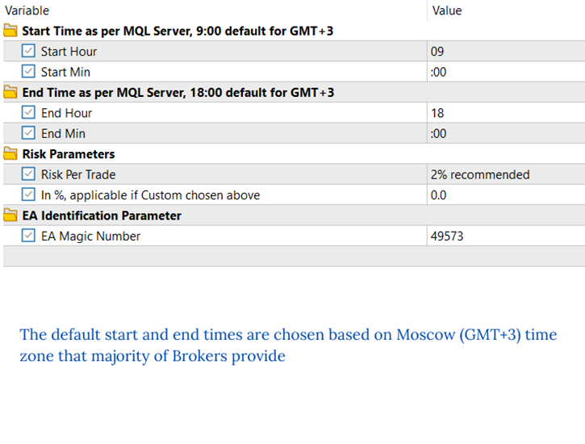
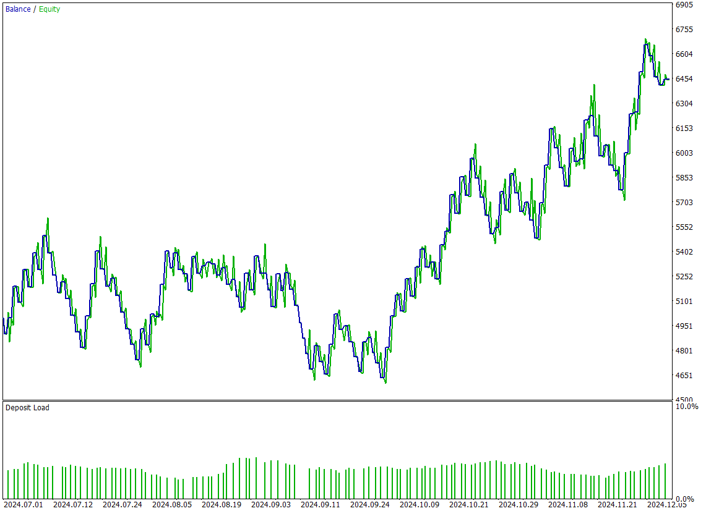
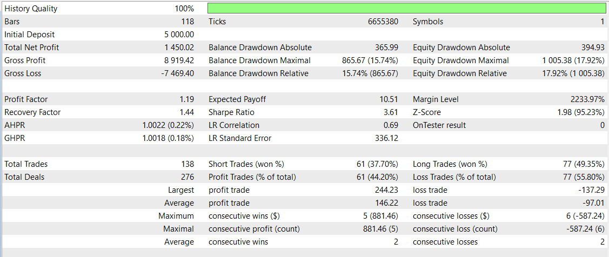

# Daily Ranger DE40 Balanced
The **Daily Ranger DE40 Balanced** is expertly designed to harness the dynamic intraday price action behaviour of Germany's top blue-chip index, the DE40, also known as DAX, GER40, DE30 or GER30. Our trading strategy capitalises on the high liquidity and predicable volatility cycles unique to DE40's most active trading hours, offering a genuine trading edge. The EA takes precise intraday entries and exits on the basis of these factors, providing a reliable advantage that can be compounded over a long term for consistent returns.  

Unlike other EAs, our approach stands apart by offering a genuine long term edge 

> NO GRID, NO MARTINGALE, NO ADDING TO LOSERS

The EA is rigorously tested with real tick data, the most accurate way to test an EA, closely mimicking real life trading conditions. We don't use interpolated ticks that mislead and give vastly different results when working with real ticks.

Experience our revolutionary approach to trading with the Balanced series, meticulously crafted for traders seeking a balanced portfolio growth with consistent returns and lower drawdowns. Select your Risk Per Trade and let our EA do the rest.

## Key Features

- ####    Standalone Operation

    The EA works entirely independently, with no need for external webservers or APIs for trading decisions

- ####     Versatile Timeframes

    Fully compatible with any timeframe chart (M1, H1, H4, D1)

- ####     Non Directional Bias

    Strategically takes both long and short positions, maximising opportunities across any market conditions

- ####     Risk Management

    User-defined Percentage Risk Per Trade, with a recommended 2% Risk Per Trade, ensuring adaptability and user control

- ####     Single Position Policy

    No opposing positions for the same symbol at a time, compatible with both Hedging and Netting accounts

- ####     Account Compatibility

    Suitable for both Raw ECN and Standard spread accounts

- ####     Optimal Trading Times

    Default start and end times are based on thorough analysis of volume metrics in DAX CFD and EUREX Futures (FDAX) markets

## Input Parameters

- ####   Start Time

    If using major brokers like IC Markets or Tickmill, your MT5 terminal runs in the Moscow (GMT+3) time zone. No changes needed. For terminals running with different time zones, adjust the default start time accordingly (e.g. for GMT-1, the default start time of 9:00 GMT+3 becomes 5:00)

- ####    End Time

    Similar to the start time, adjust the default end time for different server time zones (e.g. For GMT-1, the default end time of 18:00 GMT+3 becomes 14:00) 

 - ####   Risk Parameters

    Select from the default list of values for Risk Per Trade or choose a Custom value. If selecting Custom Risk Per Trade, enter the percentage in the specified field below

- ####    EA Identification Parameter

    Assign a positive number to uniquely identify trades placed by this EA. This is particularly useful when running multiple EAs on the same symbol

## Images
Long Term Performance Raw Spread

  

Long Term Performance Standard Spread

  

Inputs

 

Test Details

Past 6 Months Performance

Performance Evaluation

