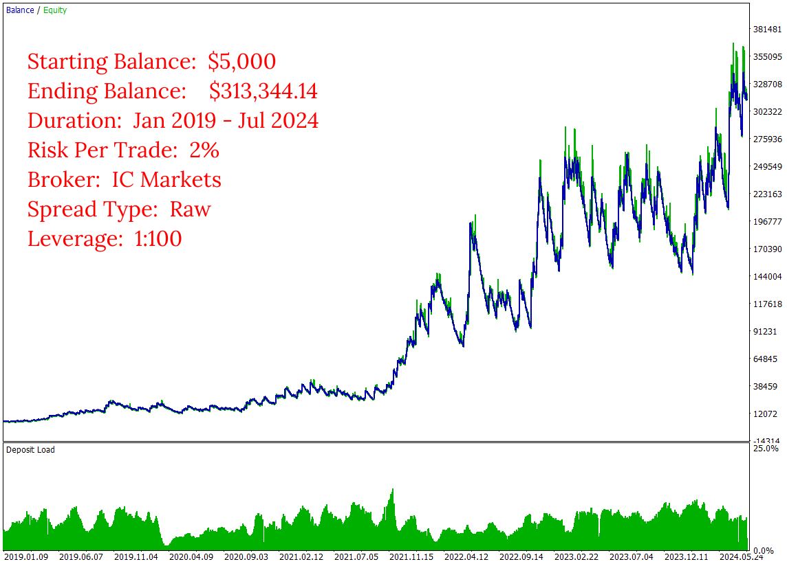
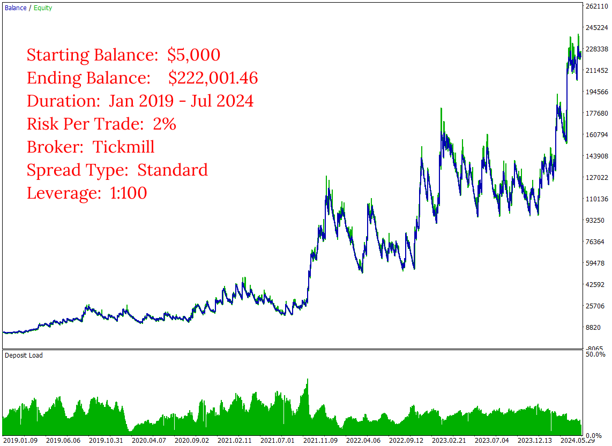
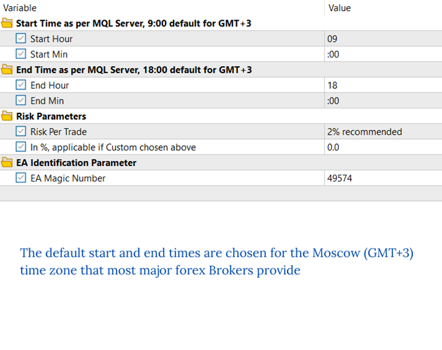
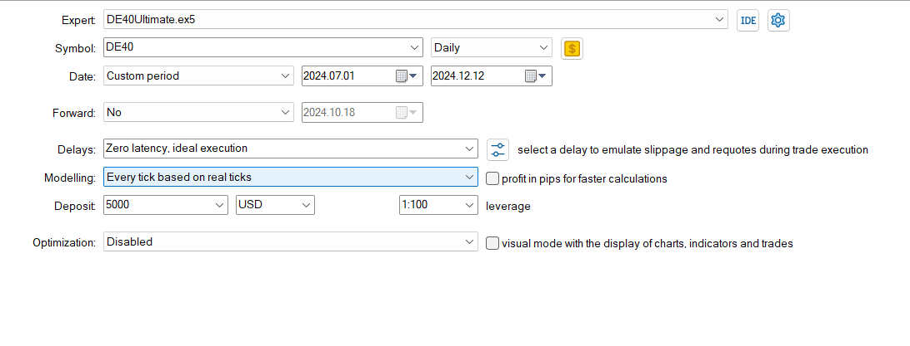
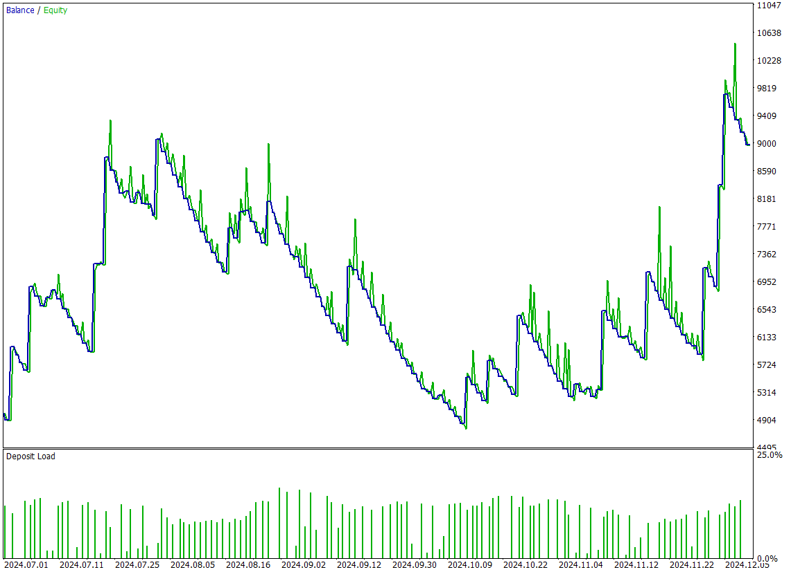
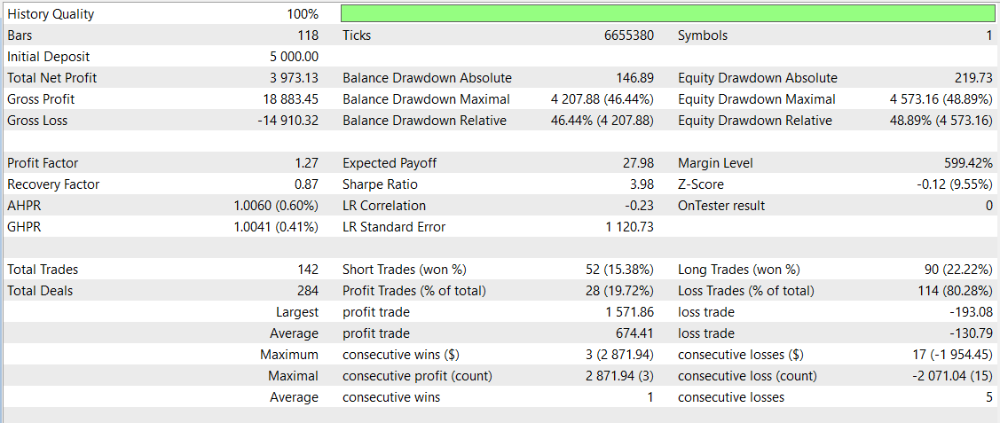

# Daily Ranger DE40 Ultimate
The **Daily Ranger DE40 Ultimate** is crafted to unlock the full intraday trading potential of Germany's premier index, the DE40 (also known as DAX, GER40, DE30 or GER30), leveraging its unique intraday price action behaviour and volatility. Our strategy is designed to capitalise on DE40's high-impact market movements, volatility cycles and liquidity surges during its peak liquid trading hours, offering a genuine edge in one of Europe's most influential markets. The EA is engineered to target optimal intraday entry and exit points, providing a reliable advantage that can be compounded over a long term for the ultimate returns and maximum profitability.

We pride ourselves in our ability to offer a pure trading edge that genuinely exploits the market's intraday structure.

> NO GRIDS, NO MARTINGALE, NO ADDING TO LOSERS

We rigorously test our EAs with real tick data, which is the most accurate way to test an EA and closely mimic real live trading conditions. We do not use interpolated ticks which mislead and give vastly different results with real ticks.

Our Ultimate series is developed to unleash the full profit potential of our strategy. Choose your preferred Risk Per Trade and let our EA do the rest.

## Key Features

- ####    Standalone Operation

    The EA works entirely independently, with no need for external webservers or APIs for trading decisions

- ####    Versatile Timeframes

    Fully compatible with any timeframe chart (M1, H1, H4, D1)

 - ####   Non Directional Bias

    Strategically takes both long and short positions, maximising opportunities across any market conditions

- ####    Risk Management

    User-defined Percentage Risk Per Trade, with a recommended 2% Risk Per Trade, ensuring adaptability and user control

 - ####   Single Position Policy

    No opposing positions for the same symbol at a time, compatible with both Hedging and Netting accounts

  - ####  Account Compatibility

    Suitable for both Raw ECN and Standard spread accounts

 - ####   Optimal Trading Times

    Default start and end times are based on thorough analysis of volume metrics in DAX CFD and EUREX Futures (FDAX) markets

## Input Parameters

 - ####     Start Time

    If using major brokers like IC Markets or Tickmill, your MT5 terminal runs in the Moscow (GMT+3) time zone. No changes needed. For terminals running with different time zones, adjust the default start time accordingly (e.g. for GMT-1, the default start time of 9:00 GMT+3 becomes 5:00)

  - ####    End Time

    Similar to the start time, adjust the default end time for different server time zones (e.g. For GMT-1, the default end time of 18:00 GMT+3 becomes 14:00) 

  - ####    Risk Parameters

    Select from the default list of values for Risk Per Trade or choose a Custom value. If selecting Custom Risk Per Trade, enter the percentage in the specified field below

 - ####     EA Identification Parameter

    Assign a positive number to uniquely identify trades placed by this EA. This is particularly useful when running multiple EAs on the same symbol

## Images
Long Term Performance Raw Spread

  

Long Term Performance Standard Spread

  

Inputs

 

Test Details

Past 6 Months Performance

Performance Evaluation

