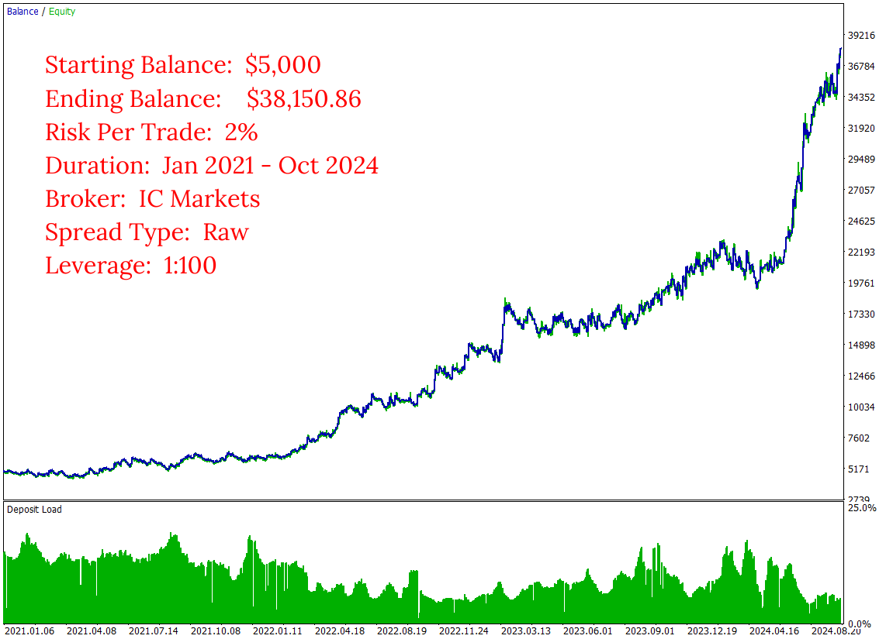

# USDJPY Balanced
The **Daily Ranger USDJPY Balanced** is designed to harness the high-impact intraday price action of USDJPY, one of the most liquid forex pairs in the world. Our trading strategy is fine-tuned to navigate USDJPY's rapid price movements, volatility cycles and liquidity driven trends during both London and New York dual-session peak activity trading hours. Our automated trading algorithm is carefully engineering to identify key intraday entry and exits, providing a reliable advantage, compoundable over the long term for consistent returns.

We pride ourselves in our commitment to offer a genuine trading edge.

> NO GRIDS, NO MARTINGALE, NO ADDING TO LOSERS

Our EA is rigorously testing using real tick data, the most accurate way of testing an EA, mimicking real life trading conditions the closest, providing a realistic and reliable performance evaluation. We do not use ideal interpolated ticks that give vastly different results when working with real ticks.

Experience our revolutionary approach to intraday trading with our Balanced series, meticulously crafted for traders seeking a balanced portfolio growth with consistent returns and lower drawdowns. Select your Risk Per Trade and let our EA do the rest.

## Key Features

- ####    Standalone Operation

    The EA works entirely independently, with no need for external webservers or APIs for trading decisions

- ####    Versatile Timeframes

    Fully compatible with any timeframe chart (M1, H1, H4, D1)

- ####    Non Directional Bias

    Strategically takes both long and short positions, maximising opportunities across any market conditions

- ####    Risk Management

    User-defined Percentage Risk Per Trade, with a recommended 2% Risk Per Trade, ensuring adaptability and user control

- ####    Single Position Policy

    No opposing positions for the same symbol at a time, compatible with both Hedging and Netting accounts

- ####    Account Compatibility

    Suitable for both Raw ECN and Standard spread accounts

 - ####   Optimal Trading Times

    Default start and end times are based on thorough analysis of volume metrics in USDJPY CFD and CME Futures (6J) markets, specifically targeting peak liquidity during both the London and New York sessions. This dual-session liquidity provides maximum opportunities for high-quality trades throughout the day

## Input Parameters

- ####    Start Time

    If using major brokers like IC Markets or Tickmill, your MT5 terminal runs in the Moscow (GMT+3) time zone. No changes needed. For terminals running with different time zones, adjust the default start time accordingly (e.g. for GMT-1, the default start time of 10:00 GMT+3 becomes 6:00)

 - ####   End Time

    Similar to the start time, adjust the default end time for different server time zones (e.g. For GMT-1, the default end time of 23:00 GMT+3 becomes 19:00) 

- ####    Risk Parameters

    Select from the default list of values for Risk Per Trade or choose a Custom value. If selecting Custom Risk Per Trade, enter the percentage in the specified field below

- ####    EA Identification Parameter

    Assign a positive number to uniquely identify trades placed by this EA. This is particularly useful when running multiple EAs on the same symbol

## Images
Long Term Performance Raw Spread

  

Long Term Performance Standard Spread

  

Inputs

 

Test Details

Past 6 Months Performance

Performance Evaluation

