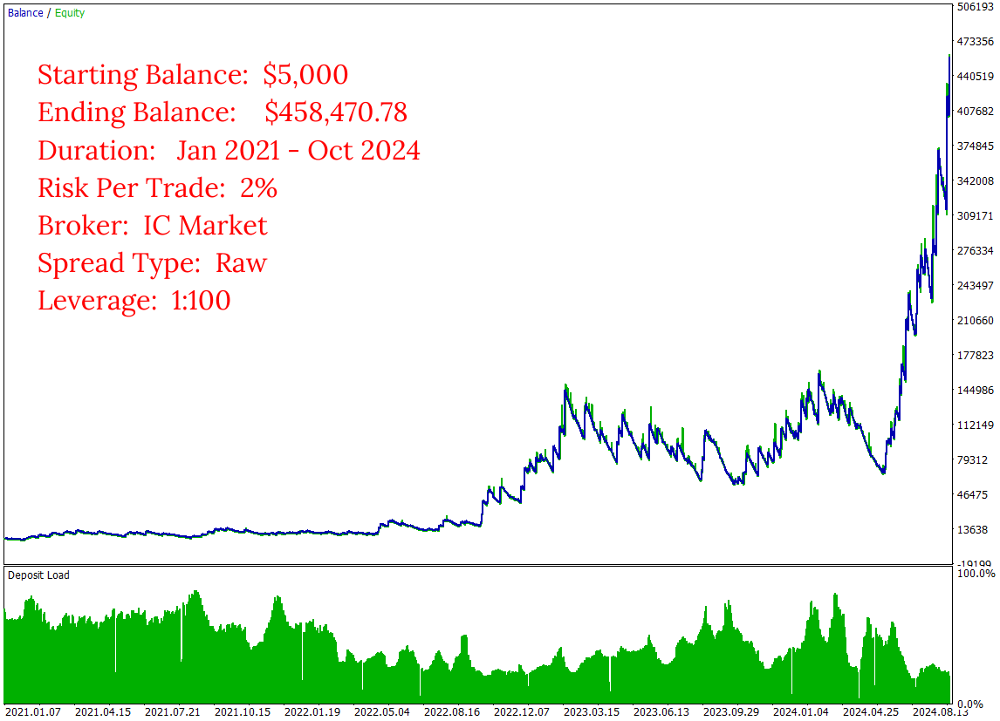
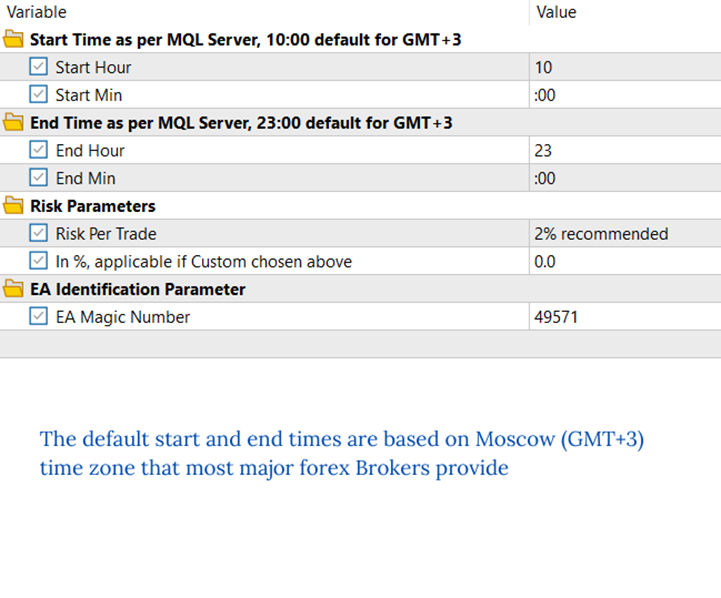
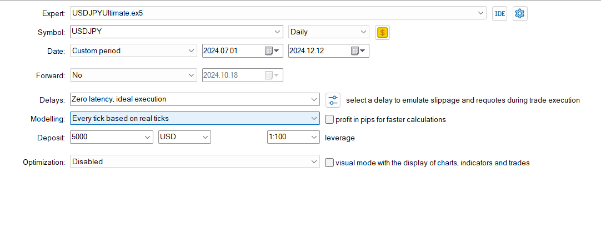
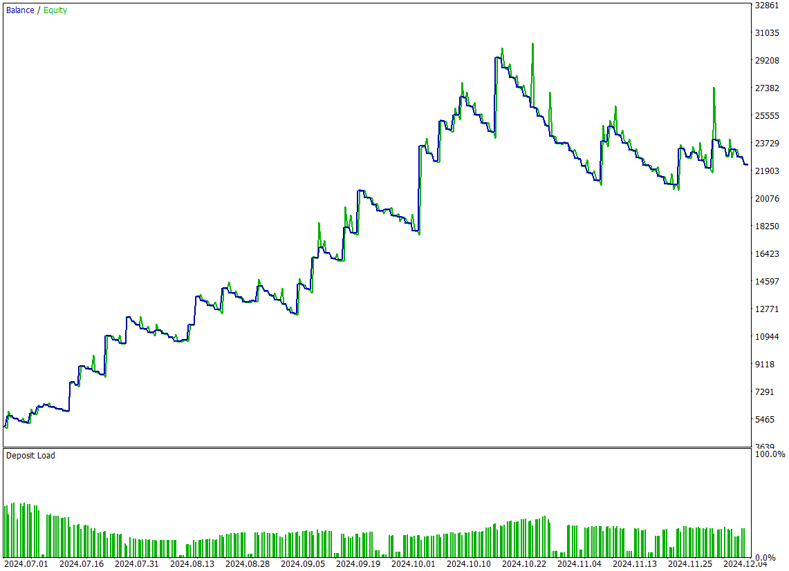
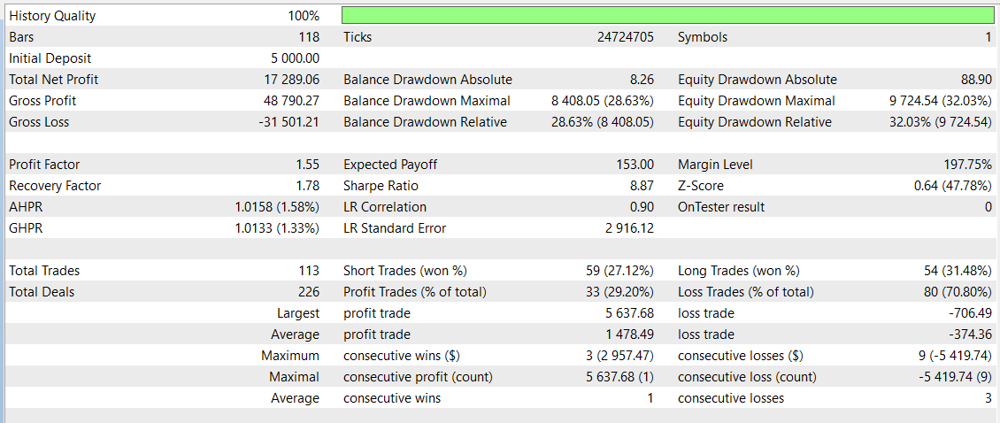

# USDJPY Ultimate

The **Daily Ranger USDJPY Ultimate** is crafted to unleash the full intraday trading potential of USDJPY, one of the most liquid forex pairs in the world, leveraging its unique price action and volatility surges. Our strategy is fine-tuned to capitalise on USDJPY's most dynamic market movements, volatility cycles and liquidity driven trends during both London and New York dual-session peak activity trading hours. Our algorithm is engineered to target optimal intraday entry and exit points, with a focus on high-growth potential, providing a reliable advantage that can be compounded over a long term for the ultimate returns and maximum profitability.

We pride ourselves in our ability to offer a pure trading edge that genuinely exploits the market's intraday structure.

> NO GRID, NO MARTINGALE, NO ADDING TO LOSERS

We rigorously test our EAs with real tick data, which is the most accurate way to test an EA and closely mimic real-life trading conditions. We do not use interpolated ticks which mislead and give vastly different results with real ticks.

Our Ultimate series is developed to unleash the full profit potential of our strategy. Choose your preferred Risk Per Trade and watch our EA navigate the liquid and dynamic price environment of USDJPY.

## Key Features

- ####    Standalone Operation

    The EA works entirely independently, with no need for external webservers or APIs for trading decisions

- ####    Versatile Timeframe

    Fully compatible with any timeframe chart (M1, H1, H4, D1)

- ####    Non Directional Bias

    Strategically takes both long and short positions, maximising opportunities across any market conditions

- ####    Risk Management

    User-defined Percentage Risk Per Trade, with a recommended 2% Risk Per Trade, ensuring adaptability and user control

- ####    Single Position Policy

    No opposing positions for the same symbol at a time, compatible with both Hedging and Netting accounts

- ####    Account Compatibility

    Designed to operate in Raw spread conditions, for Standard spread accounts check out our Balanced series.

- ####    Optimal Trading Times

    Default start and end times are based on thorough analysis of volume metrics in USDJPY CFD and CME Futures (6J) markets, specifically targeting peak liquidity during both the London and New York sessions. This dual-session liquidity provides maximum opportunities for high-quality trades throughout the day

## Input Parameters

- ####    Start Time

    If using major brokers like IC Markets or Tickmill, your MT5 terminal runs in the Moscow (GMT+3) time zone. No changes needed. For terminals running with different time zones, adjust the default start time accordingly (e.g. for GMT-1, the default start time of 10:00 GMT+3 becomes 6:00)

- ####    End Time

    Similar to the start time, adjust the default end time for different server time zones (e.g. For GMT-1, the default end time of 23:00 GMT+3 becomes 19:00) 

- ####    Risk Parameters

    Select from the default list of values for Risk Per Trade or choose a Custom value. If selecting Custom Risk Per Trade, enter the percentage in the specified field below

- ####    EA Identification Parameter

    Assign a positive number to uniquely identify trades placed by this EA. This is particularly useful when running multiple EAs on the same symbol

## Images
Long Term Performance Raw Spread

Inputs

 

Test Details

Past 6 Months Performance

Performance Evaluation

