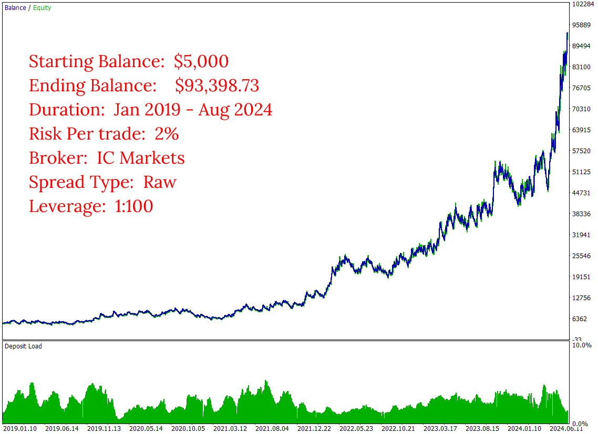
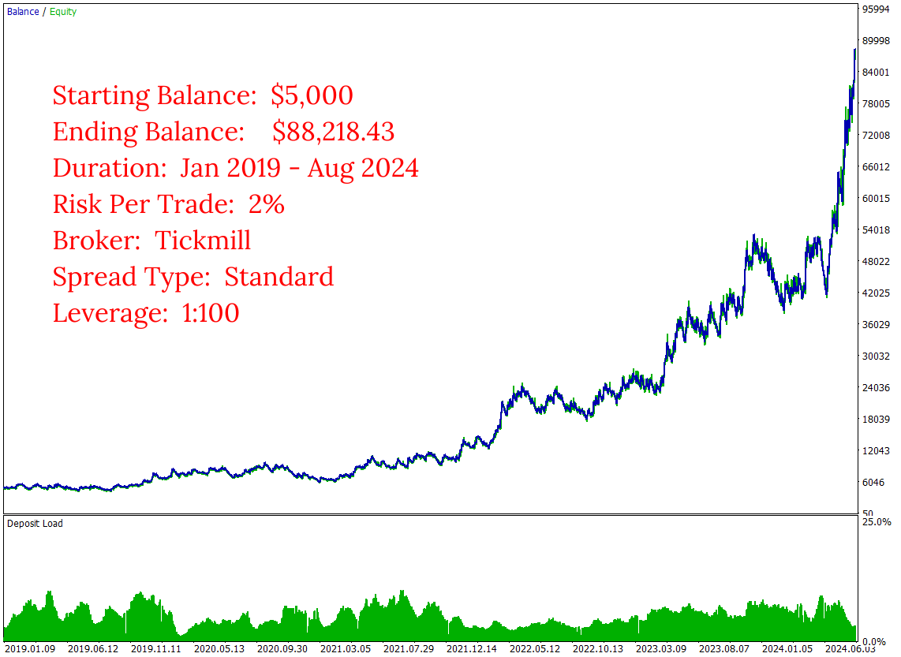
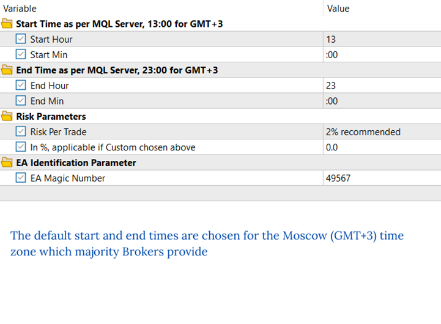
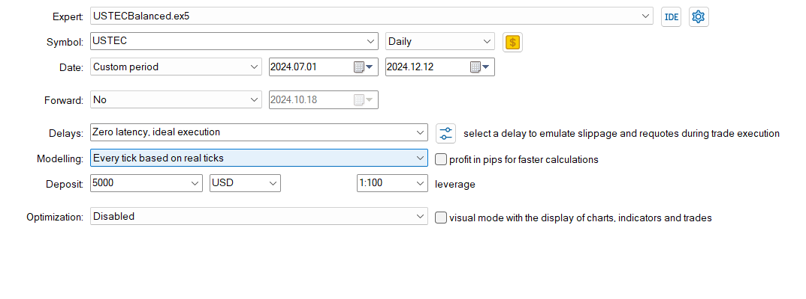
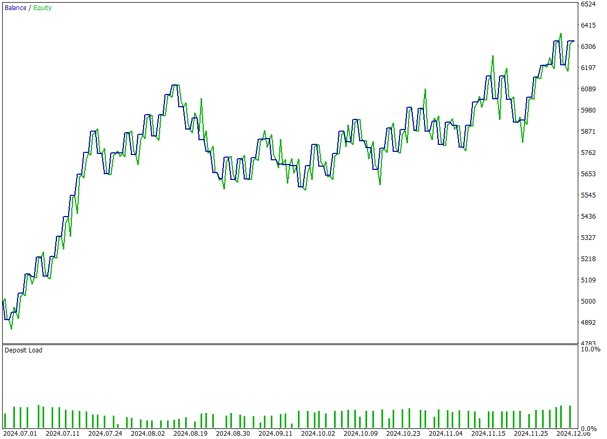
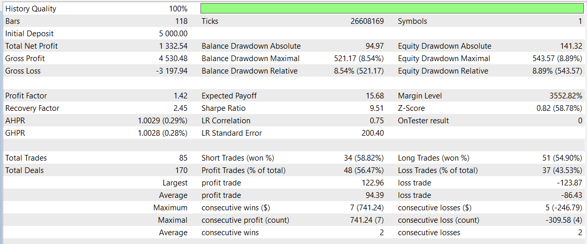

# Daily Ranger USTEC Balanced
The **Daily Ranger USTEC Balanced** is expertly designed to unlock the true trading potential of Nasdaq's dynamic intraday price action behaviour during its most liquid trading hours. Known as USTEC, NAS100, US100, NQ100, the Nasdaq index represents a highly liquid and tech-driven market that sees distinct volatility cycles and liquidity surges. Our trading algorithm is carefully engineered to identify key intraday entry and exit points on the basis of these factors, providing a reliable advantage that can be compounded over a long term for consistent returns.

Unlike other EAs, our approach stands apart by offering a genuine old school trading edge

> NO GRIDS, NO MARTINGALE, NO ADDING TO LOSERS

Our EA is rigorously tested with real tick data, the most accurate way to test an EA and mimic real life trading conditions, providing a realistic and reliable performance evaluation. We do not use ideal interpolated ticks that give vastly different results when working with real ticks.

Experience a revolutionary trading edge with our Balanced series, meticulously crafted for traders seeking stable returns with lower drawdowns, providing a balanced approach to portfolio growth. Simply choose your Percentage Risk Per Trade and let our EA do the rest. 

## Key Features

- ####    Standalone Operation

    The EA works entirely independently, with no need for external webservers or APIs for trading decisions

 - ####    Versatile Timeframes

    Fully compatible with any timeframe chart (M1, H1, H4, D1)

- ####     Non Directional Bias

    Strategically takes both long and short positions, maximising opportunities across any market conditions

- ####     Risk Management

    User-defined Percentage Risk Per Trade, with a recommended 2% Risk Per Trade, ensuring adaptability and user control

- ####     Single Position Policy

    Maintains a single active position per symbol, making it suitable for both Hedging and Netting accounts

- ####     Account Compatibility

    Suitable for both Raw ECN and Standard spread accounts

- ####     Optimal Trading Times

    Default start and end times are based on thorough analysis of volume patterns in NASDAQ CFD and CME Futures (NQ) markets

## Input Parameters

- ####    Start Time

    If using major brokers like IC Markets or Tickmill, your MT5 terminal runs in the Moscow (GMT+3) time zone. No changes needed. For terminals running with different time zones, adjust the default start time accordingly (e.g. for GMT-1, the default start time of 13:00 GMT+3 becomes 9:00)

- ####    End Time

    Similar to the start time, adjust the default end time for different server time zones (e.g. For GMT-1, the default end time of 23:00 GMT+3 becomes 19:00) 

- ####    Risk Parameters

    Select from the default list of values for Risk Per Trade or choose a Custom value. If selecting Custom Risk Per Trade, enter the percentage in the specified field below

- ####    EA Identification Parameter

    Assign a positive number to uniquely identify trades placed by this EA. This is particularly useful when running multiple EAs on the same symbol

## Images
Long Term Performance Raw Spread

  

Long Term Performance Standard Spread

  

Inputs

 

Test Details

Past 6 Months Performance

Performance Evaluation

