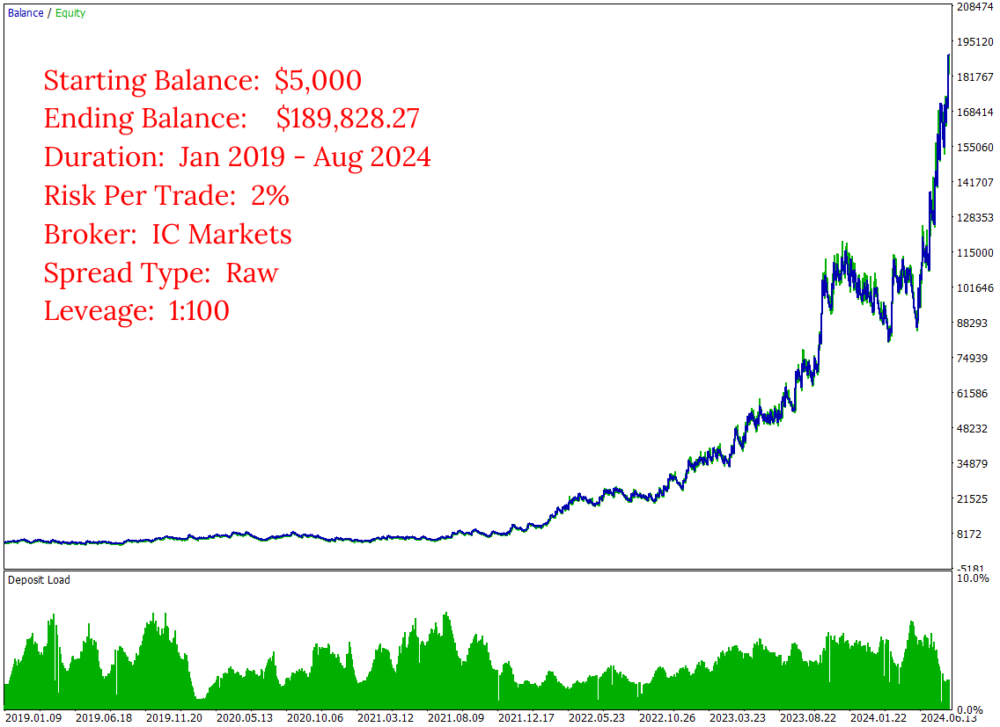
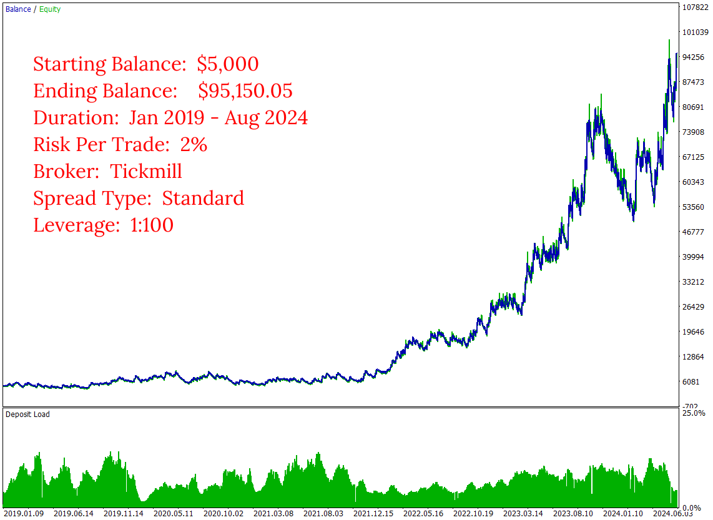
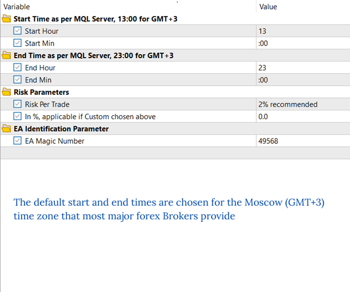
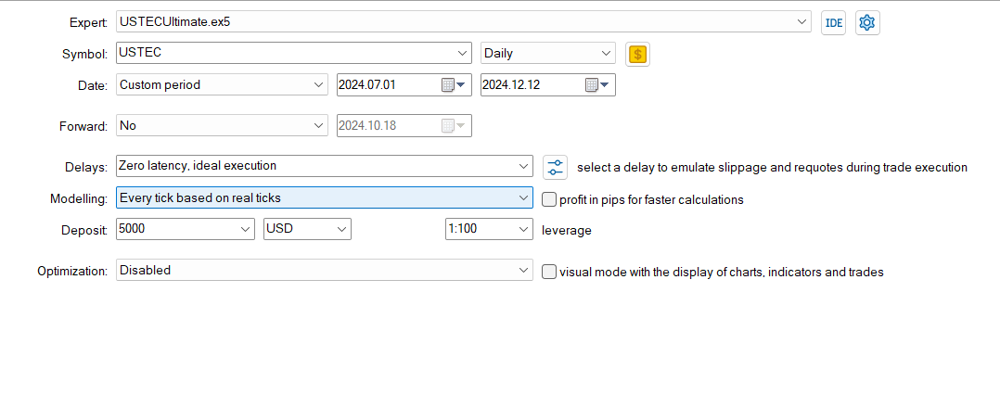
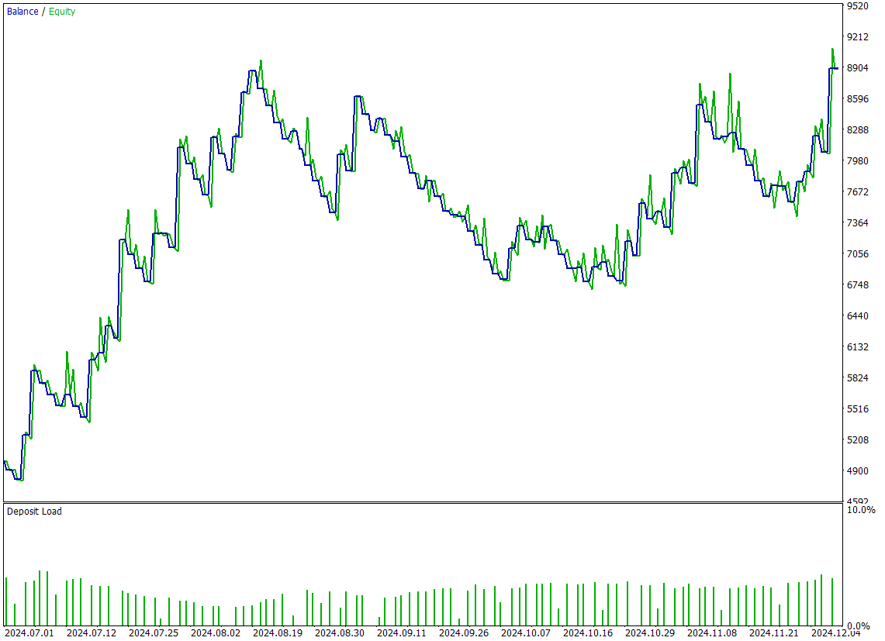
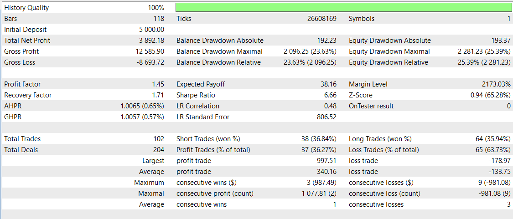

# Daily Ranger USTEC Ultimate

The **Daily Ranger USTEC Ultimate** EA is designed to capture the full potential of the Nasdaq index's (also known as USTEC, US100, NAS100, NQ100) distinctive intraday volatility. Our trading strategy is fine-tuned to navigate the index's dynamic price action capitalising on the high-impact tech driven fluctuations, volatility cycles and liquidity surges that are signature to Nasdaq's most active trading hours. Our algorithm is carefully engineered to identify key intraday entry and exit points, providing a reliable advantage that can be compounded over a long term for the ultimate returns.

We pride ourselves in our ability to offer a pure trading edge that genuinely exploits the market's intraday structure.

> NO GRID, NO MARTINGALE, NO ADDING TO LOSERS

Our EA is meticulously tested with real tick data, the most accurate way to test an EA, mimicking real life trading conditions the closest, providing a realistic and reliable performance evaluation. We do not use ideal interpolated ticks that give vastly different results when working with real ticks. 

Our Ultimate series is developed to unleash the full profit potential of our strategy. Choose your preferred Risk Per Trade, and watch our EA navigate Nasdaq's dynamic price environment.

## Key Features

- ####    Standalone Operation

    The EA works entirely independently, with no need for external webservers or APIs for trading decisions

- ####      Versatile Timeframes

    Fully compatible with any timeframe chart (M1, H1, H4, D1)

- ####      Non Directional Bias

    Strategically takes both long and short positions, maximising opportunities across any market conditions

- ####      Risk Management

    User-defined Percentage Risk Per Trade, with a recommended 2% Risk Per Trade, ensuring adaptability and user control

- ####      Single Position Policy

    No opposing positions for the same symbol at a time, compatible with both Hedging and Netting accounts

- ####      Account Compatibility

    Suitable for both Raw ECN and Standard spread accounts

- ####      Optimal Trading Times

    Default start and end times are based on thorough analysis of volume patterns in NASDAQ CFD and CME Futures (NQ) markets

## Input Parameters

- ####      Start Time

    If using major brokers like IC Markets or Tickmill, your MT5 terminal runs in the Moscow (GMT+3) time zone. No changes needed. For terminals running with different time zones, adjust the default start time accordingly (e.g. for GMT-1, the default start time of 13:00 GMT+3 becomes 9:00)

- ####      End Time

    Similar to the start time, adjust the default end time for different server time zones (e.g. For GMT-1, the default end time of 23:00 GMT+3 becomes 19:00) 

- ####      Risk Parameters

    Select from the default list of values for Risk Per Trade or choose a Custom value. If selecting Custom Risk Per Trade, enter the percentage in the specified field below

- ####      EA Identification Parameter

    Assign a positive number to uniquely identify trades placed by this EA. This is particularly useful when running multiple EAs on the same symbol

## Images
Long Term Performance Raw Spread

  

Long Term Performance Standard Spread

  

Inputs

 

Test Details

Past 6 Months Performance

Performance Evaluation

